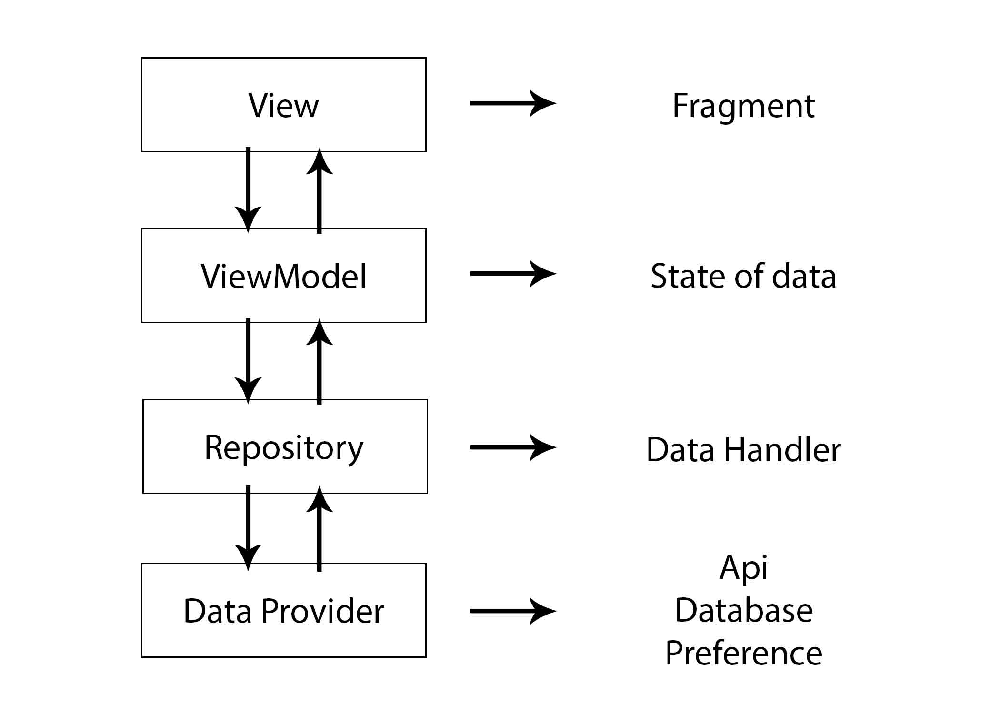

# Android MVVM Architecture with LiveData

### Project Structure
* Data folder: Containing 2 another folder are:
  - Models: Containing classes **describe objects** in the project.
  - Repositories: Containing classes have able **access to the data source**.
  
* Features folder:
  - Containing features in app.
  - Has 2 classes per features are: 
    - Fragment: The class which present UI user can **visible and interact**.
    - ViewModel: The class which **stores Fragment' local state** and can **access Repositories to get data source**.

* Modules folder:
  - Containing API modules for a sigle responsibility such as: service, social login api, v.v...
  
* Providers folder:
  - Containing ViewModel classes which **store global state**, can **access Repositories to get data source** and **is accessed from 2 or features**
  
* Statics folder:
  - Containing classes have value constant.
  
* Views folder:
  - Containing custom view classes.

### Must implement Dependency Injection to reuse, testing and maintain.

### Testing: at least implement unit test and integration test.

