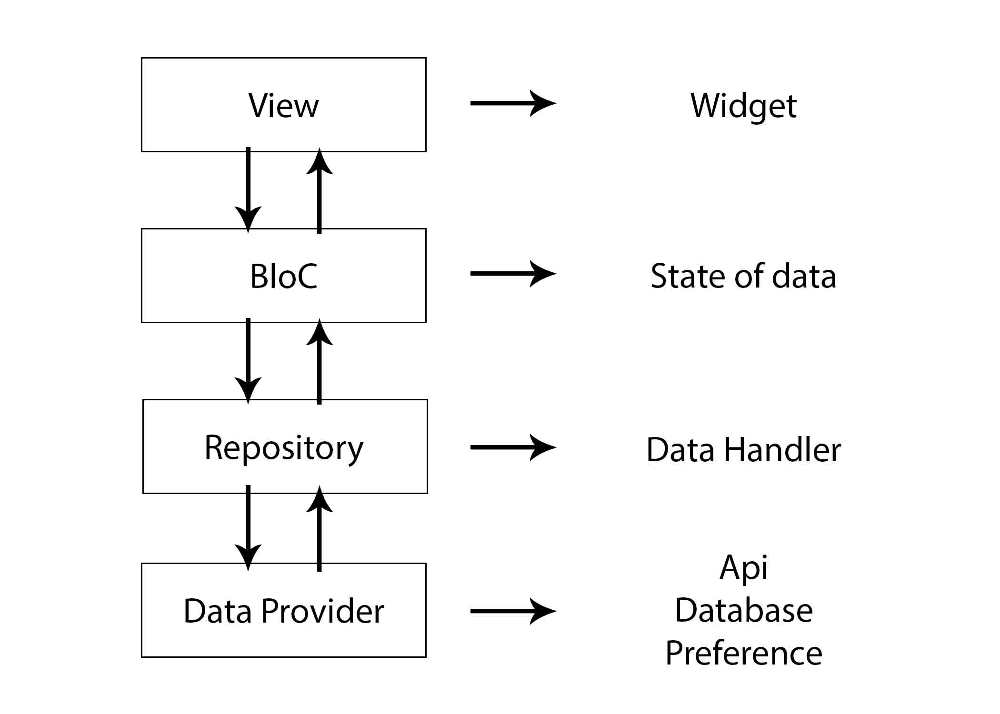

# flutter_bloc_pattern

A base architecture - bloc pattern

## Getting Started

For help getting started with Flutter, view our online
[documentation](https://flutter.io/).

### Project Structure
* **Data folder**: Containing 2 another folder are:
  - Models: Containing classes **describe objects** in the project.
  - Repositories: Containing classes have able **access to the data source**.
  
* **Features folder**:
  - Containing features in app.
  - Has 2 classes per features are: 
    - Widget: The class which present UI user can **visible and interact**.
    - Bloc: The class which **stores Widget' local state** and can **access Repositories to get data source**.

* **Modules folder**:
  - Containing API modules for a sigle responsibility such as: service, social login api, v.v...
  
* **Providers folder**:
  - Containing Provider classes which **store global state**, can **access Repositories to get data source** and **is accessed from 2 or features**
  
* **Statics folder**:
  - Containing classes have value constant.
  
* **Widgets folder**:
  - Containing custom widget classes.

### Must implement Dependency Injection to reuse, testing and maintain.

### Testing: at least implement unit test and integration test.

